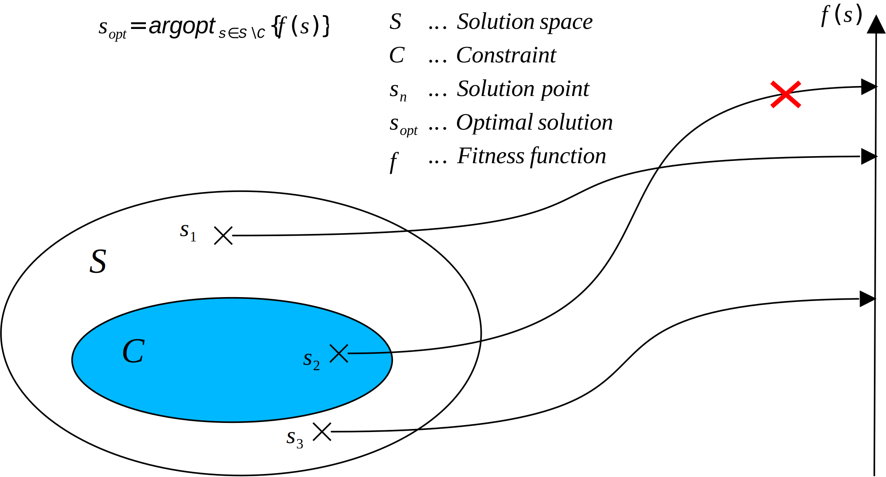

# Problem-solving best practices

Before describing best practises for implementing optimization algorithms with Jenetics, we should recap what an optimization problem actually is.

> In mathematics, engineering, computer science and economics, an optimization problem is the problem of finding the best solution from all feasible solutions.
> 
> [_Wikipedia_: Optimization problem](https://en.wikipedia.org/wiki/Optimization_problem)

A graphical representation of an optimization problem is shown in the diagram above.



 From a given solution space, _S_, we want to find the solution with the _optimal_ fitness value, which fulfills a given constraint, _C_. With this definition, we can start and suggest some implementation strategies using Jenetics.

## General strategy

Jenetics uses the `Genotpye` class as unified view onto the solution space of the problem. For trivial "Hello World"-problems, it is totally fine to describe the solution space in terms of this class. E.g. for the Bit-count _text book_ example, where the fitness function directly uses the `Genotype` as input parameter.

```java
static int count(final Genotype<BitGene> gt) {
    return gt.chromosome()
        .as(BitChromosome.class)
        .bitCount();
}
```

For non-trivial optimization problems, using the encoding classes  `Genotype`, directly is not the best way using the Jenetics library. 

It is recommended to first find a domain model, `T`, which best represents your solution space. Ideally, the domain model doesn't allow the modelling of invalid solutions. The fitness function calculates the fitness value with the model class `T`, instead of the `Genotype`, which usually simplifies the implementation. 

To connect the _native_ domain model and the fitness function with the Jenetics `Engine`, an appropriate `Codec` must be implemented. The `Codec` is the connector between the _native_ model and the `Engine`. With this approach, one can separate the problem of implementing the fitness function from the _mapping_ between `Genotype` and _native_ model `T`.

> **General solution steps**
> 1) Find domain model, `T`, for the solution space.
> 2) Implement the fitness function in terms of `T`.
> 3) Find a `Codec` which maps a `Genotype` to `T`. 
> 4) Setup `Engine` with `Codec` and fitness function, _f(T)_.

The following code snippet shows how to use a `Codec` for the Ones-count problem, introduced above. It shows the steps 2 to 4 from the general solution template. Step 1, finding the domain model representing the solution space, is trivial in this example: `T := int`.

```java
// 2. Fitness function working on native solution space.
static int count(final int count) {
    return count;
}

// 3. Codec for Genotype <--> int mapping.
final Codec<Integer, BitGene> codec = Codec.of(
    Genotype.of(BitChromosome.of(100)),
    gt -> gt.chromosome()
        .as(BitChromosome.class)
        .bitCount()
);

// 4. Engine creation.
final static Engine<BitGene, Integer> eng = Engine
    .builder(this::count, codec)
    .build();
```

## Combinatorial problems


## Unify heterogeneous (numerical) chromosomes

The `Genotype` only allows to have chromosomes with the same `Gentype`. It is not allowed to use different chromosome types within the same `Genotype` and the following code would lead to a compile error.

```java
// Model class for native problem domain.
record Tuple(int a, long b, double c) {}

var codec = Codec.of(
    // Invalid 'Genotype' definition; will not compile.
    Genotype.of(
        IntegerChromosome.of(IntRange.of(0, 100)),
        LongChromosome.of(LongRange.of(0, Long.MAX_VALUE/2)),
        DoubleChromosome.of(DoubleRange.of(0, 1))
    ),
    genotype -> new Tuple(
        genotype.gene().intValue(),
        genotype.gene().longValue(),
        genotype.gene().doubleValue()
    )
);
```

If the `Genotype` only consists of `DoubleChromosome`s, the `Codec` will compile and work like intended.

```java
var codec = Codec.of(
    // Will compile now.
    Genotype.of(
        DoubleChromosome.of(DoubleRange.of(0, 100)),
        DoubleChromosome.of(DoubleRange.of(0, Long.MAX_VALUE/2)),
        DoubleChromosome.of(DoubleRange.of(0, 1))
    ),
    genotype -> new Tuple(
        genotype.gene().intValue(),
        genotype.gene().longValue(),
        genotype.gene().doubleValue()
    )
);
```

If your `Genotype` encoding requires different kinds of _numerical_ chromosomes, 

